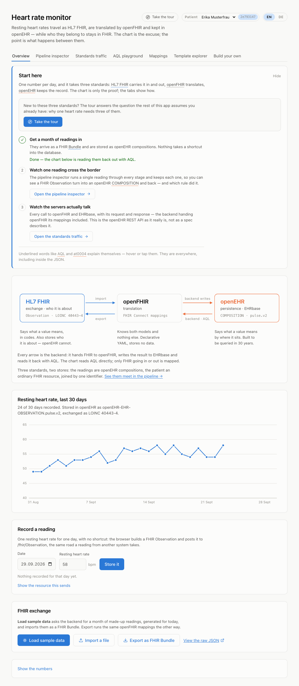
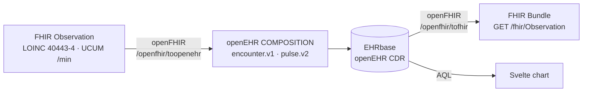
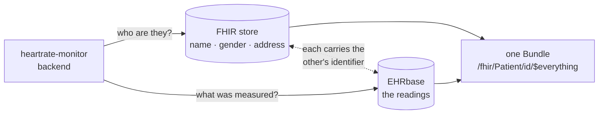

# heartrate-monitor

A small application that shows the resting heart rate of the last 30 days.

It is a tech-stack demo for **openEHR** (persistence, via EHRbase), **HL7 FHIR** (exchange), and
**openFHIR** (the mapping engine between the two, driven by FHIR Connect mappings).



## How the standards fit together

No *clinical* data is stored in FHIR and nothing is exchanged in openEHR — each standard does the one
job it is good at, and openFHIR is the only thing that knows how to get from one to the other. Where
the administrative half of a record lives is a separate question, and the next section is about it.



- **Importing.** A resting heart rate becomes an `Observation` (LOINC `40443-4`, category
  `vital-signs`, UCUM `/min`). openFHIR maps it onto `openEHR-EHR-OBSERVATION.pulse.v2` inside an
  `openEHR-EHR-COMPOSITION.encounter.v1`, and EHRbase validates and stores it.
- **Reading.** AQL pulls the values back out of the CDR for the chart.
- **Exporting.** `GET /fhir/Observation` sends the stored compositions back through openFHIR, so
  outgoing FHIR is produced by the same mapping definition as incoming FHIR.

Data only ever enters through the FHIR endpoints — no back door into the database, and no seeding.
Even the by-hand entry form builds a FHIR Observation in the browser and posts it to
`/fhir/Observation` like any other client would.

## Two stores, and which answers what

The diagram above is the translation axis. There is a second one: where a record actually lives.

openEHR anchors a record on an identifier and nothing more — `EHR_STATUS.subject` has no room for a
name, a gender or an address. So a patient could be pointed at but never described, and
`Observation.subject` referred to a Patient that existed nowhere. `fhir-server/`
is where those belong.

| Question | Answered by |
|---|---|
| Which patients exist? | configuration (`heartrate.patients`) — the demo's roster |
| Who are they? | the FHIR store — name, gender, birth date, address |
| What was measured? | openEHR, as compositions in EHRbase |

The two are joined by one ordinary identifier: the Patient carries its EHR id as a secondary
identifier, and openEHR carries the patient id in `EHR_STATUS.subject`. Either side can be reached
from the other, and neither server knows the other exists.



That dotted line is the whole join. It is not a foreign key and neither server resolves it — each
side simply carries the other's identifier, and the backend is the only thing that ever follows it.

`GET /fhir/Patient/{id}/$everything` is the only place both halves meet — one Bundle, assembled from
two stores, with nothing in it saying which entry came from where. The **Two stores** tab shows that
assembly taken apart again.

Keeping the roster in configuration rather than in the FHIR store is what lets the halves fail
independently: stop `fhir-server` and the chart still draws, the AQL playground still answers, and
only the names fall back to the seed.

**No index table stands between the two.** A FHIR `Observation.id` here *is* the openEHR versioned
object uid, assigned by this service on create rather than taken from the client — so reading one
back is a composition read, not a translation, and `meta.versionId` carries openEHR's version
straight through. Correct a reading and the id stays while the version moves.

## Importing data

`POST /fhir/Bundle` (and the **Import a file** button) takes a FHIR Bundle carrying resting heart
rate Observations. Codings are normalised on the way in, so an Observation using `{beats}/min` or
`bpm` rather than `/min` still imports, and one coded with SNOMED `444981005` instead of LOINC
`40443-4` does too — rejecting equally-correct FHIR would be a bug, not strictness.

The answer is a FHIR `OperationOutcome` saying what went in and what did not:

```json
{"resourceType":"OperationOutcome","issue":[
  {"severity":"information","diagnostics":"Imported 22 heart rate observations."},
  {"severity":"warning","diagnostics":"Skipped 1 Observation (not a resting heart rate (no LOINC 40443-4 coding))"}]}
```

## The guided tour

Every other part of this application explains *how* the three standards work. None of them answers
why one heart rate needs three standards at all — and that is the question someone meeting openEHR
for the first time actually has. The tour is that answer, told as one argument in twelve steps, one per tab and then some, using
the tabs as its stage:

1. **What this is.** A heart rate monitor: one resting heart rate per day. That is the entire
   feature, and it is the excuse.
2. **One number: 58.** It is in the entry field on screen. Storing it is trivial; storing it so it
   survives twenty years and a change of hospital is the real problem.
3. **Why a database column is not enough.** `bpm INT` holds 58. It does not hold the unit, whether
   the patient was at rest, who measured it, or with what.
4. **What FHIR contributes** — the number says what it is, in codes, so it can cross a boundary.
5. **What openEHR does differently** — the LOINC code is gone; the meaning is now the *place*, an
   internationally agreed archetype. And openEHR demands what FHIR never sent.
6. **Two models, not one in two formats** — what the round trip does not bring back, and why that is
   not a bug.
7. **So something has to translate** — openFHIR, and the rules it follows.
8. **What the model allows, and what is used** — ten of the template's twenty-three nodes, and the
   INTERVAL_EVENT slot the mapping never fills.
9. **The record does not forget** — correcting adds a version, it never overwrites.
10. **Watch it happen** — the calls to both servers, as they really were.
11. **And it stays queryable** — AQL by archetype path.
12. **That is the whole idea.**

Each step switches to the tab it belongs on, selects the right pipeline stage where that matters, and
rings the thing it is talking about — so "notice the LOINC code is gone" arrives with the JSON on
screen rather than as a claim. It can be stopped at any point, and the compass button beside the title
starts it again from any tab.

The **Start here** panel can be hidden once it has served its purpose; a link in its place brings it
back, and the tour is reachable from the header regardless.

## Finding your way in

The overview opens with a **Start here** panel: three steps in the order that makes sense — get a
month of readings in, watch one of them cross into openEHR, watch the servers talk. It notices when
step one is already done, and it can be dismissed for good.

Every term the app puts on screen explains itself where it appears. `at0004`, `DV_QUANTITY`,
`archetype_node_id`, `PARTY_SELF`, `AQL`, LOINC `40443-4` — anything underlined is hoverable,
**including inside the JSON panels**, which is where the vocabulary is at its most opaque and where
a glossary page would be least use. Around thirty terms are covered; each says what the thing is and
what it is not to be mistaken for, which is usually the part that matters:

> **POINT_EVENT** — A value measured at one moment. The alternative is an INTERVAL_EVENT, which
> carries a math_function and means "the minimum over the day". FHIR leaves that distinction to the
> code; openEHR puts it in the structure.

The terms live in `frontend/src/lib/glossary.ts`; adding one makes it hoverable everywhere at once.

## English and German

The switch beside the title changes both halves of the application. Most of the teaching text is
generated by the backend — the pipeline stages, what each mapping did, why a reading was refused —
so every request carries `Accept-Language`, and Spring resolves it per request. Translating the
buttons while leaving the explanations in English would translate the packaging and not the content.

- Backend text: `backend/src/main/resources/messages.properties` and `messages_de.properties`.
  A test asserts the two files carry exactly the same keys and that nothing German is still the
  English string — a key present in one and missing in the other shows up as a raw `explain.composition`
  where a paragraph should be, and nothing else catches that.
- Frontend text: `frontend/src/lib/i18n.svelte.ts`, with the glossary's German bodies in
  `glossary.ts`.

Terminology stays untranslated on purpose. `COMPOSITION`, `Archetyp`, `Template`, `Observation`,
`DV_QUANTITY`, `at0004` — those are the words in the specifications and the strings visible in the
JSON panels. Germanising them would break exactly the recognition the glossary exists to support.

The language is remembered, and follows the browser on a first visit.

## The pipeline inspector

The chart is the excuse; the standards are the point, and an import that works hides everything
worth seeing. The **Pipeline inspector** tab runs one reading through the same path an import takes
and keeps every intermediate form, writing nothing unless you tick the box:

```
FHIR Bundle → FHIR Observation → FHIR Bundle → openEHR COMPOSITION → EHRbase → AQL → FHIR again
   Client          Backend          Backend         openFHIR          EHRbase  EHRbase  openFHIR
```

Each stage is shown beside the one it came from, so every screen reads "this became that". On the
openFHIR stage a row of correspondences lights up the matching lines in both documents at once and
highlights the FHIR Connect rule that produced them — including the two that are not value copies:

- **The code selects the archetype.** LOINC 40443-4 never becomes data in openEHR. It is a
  condition; it decides which archetype the value lands in, and the archetype is then where the
  meaning lives. FHIR says what it means in its codes, openEHR in its structure.
- **What openEHR demands and FHIR never sent.** `composer`, `language`, `territory`, `category` and
  `context` are mandatory in the openEHR reference model and are nowhere in the Bundle.

The last stage maps the composition back to FHIR through the same files and lists what did not
survive — the coding systems, the display names, the subject reference. The round trip is not
lossless, and seeing exactly where it loses is the shortest explanation of how the two models
differ.

Three ready-made inputs cover the interesting cases: a textbook Bundle, the same reading spelled
with SNOMED and `bpm` instead of LOINC and `/min`, and an Observation coded 8867-4 — a heart rate,
but not a resting one — which stops the pipeline at the door. Any file of your own works too.

Picking a correspondence also offers **Open the rule in …**, which jumps to the Mappings tab with
that rule highlighted.

## The mappings, and editing them

The **Mappings** tab opens with **What becomes what** — every rule the files declare, read out of
them rather than written alongside:

```
rate               $resource.value       →  $archetype/…/items[at0004]     pulse.model.yaml:32
time               $resource.effective   →  $archetype/…/events[at0003]/time
hardcodedMappings  $resource             →  $archetype
  code             writes  code.coding.code  = 40443-4
  status           writes  status            = final
```

Two kinds, and the difference is the interesting part. A **correspondence** connects a FHIR path to
an openEHR path. A **constant** writes a fixed value into outgoing FHIR — which is how an exported
Observation carries a LOINC code that openEHR never stored, because in openEHR that meaning lives in
the archetype instead. Indentation is the nesting: a nested rule only applies inside its parent.
Picking one finds it in the file below.

Because the list is parsed from the YAML, editing a mapping changes it. A list that could disagree
with the file would be worse than none.

The files themselves are editable. **Edit this mapping**
writes the real file in `openfhir-bootstrap/` and asks openFHIR to re-read its bootstrap directory.
No rebuild, no restart, because the mappings are data.

Picking a correspondence in the pipeline inspector offers **Open the rule in …**, which brings you
here with the right file open and the rule highlighted. Coming back re-runs the trace, so a mapping
you just changed is reflected immediately.

Which makes the most instructive thing you can do breaking one on purpose. Change the LOINC code in
`pulse.model.yaml` from `40443-4` to anything else, save, and go back to the inspector:

```
1 FHIR Bundle → 2 FHIR Observation → 3 FHIR Bundle → 4 openEHR COMPOSITION ✗

openFHIR answered with an empty composition — nothing in the Bundle matched the
conditions in pulse.model.yaml.
```

The Observation is still valid FHIR. openFHIR still runs. It simply no longer recognises the
resource as a pulse, so nothing lands in the archetype — which is the clearest possible statement of
what that code was doing there. An edited file is marked with a dot, and **Reset to the shipped
version** puts it back.

A mapping openFHIR refuses to load is still written to disk; the answer says what it objected to and
the engine keeps running with what it read last. Hiding that would remove the lesson.

## The standards traffic console

The **Standards traffic** tab is a network console for the two standards servers only: every call
the backend made to openFHIR and EHRbase, newest first, each one expandable to its request and
response body. It is where the openEHR REST API stops being a spec and becomes something you watch —
a COMPOSITION going to `POST /ehr/{id}/composition` and coming back 204 with the version uid in an
`ETag`, an AQL query being answered, the template upload answering 409 on every restart after the
first because the template is already known.

The buffer holds the last 300 calls in memory and is not an audit log. Headers are deliberately not
recorded: EHRbase runs with basic auth and its credentials have no business in a browser panel.

## The AQL playground

The **AQL playground** tab runs a query you typed against the real record. AQL is openEHR's own
query language and the reason an openEHR record is queryable without knowing how it is stored: it
selects by archetype path, so a query written against the pulse archetype runs on any openEHR system
that knows that archetype.

Six ready-made queries, each there to show one thing — the query the chart actually runs, a whole
composition, which archetypes are in the record, aggregates, the versioning underneath
(`CONTAINS VERSION`), and this one:

```
SELECT o/data[at0002]/events[at0003]/data[at0001]/items[at9999]/value/magnitude AS bpm
FROM EHR e[ehr_id/value=$ehrId]
  CONTAINS OBSERVATION o[openEHR-EHR-OBSERVATION.pulse.v2]
```

`at9999` is not in the pulse archetype. It does not fail — ten rows come back, one per observation,
every value null. **A wrong path is not an error in AQL**, it simply matches nothing, and that is the
failure mode worth meeting deliberately rather than in production.

Each result shows its column metadata: the AQL path behind every column name, which is where the
names come from and what an aggregate column lacks. `$ehrId` is filled in automatically — making
someone paste a uuid before their first query teaches nothing about AQL.

Read-only, and not by enforcement: AQL has no write operations at all. The guard that rejects
anything not starting with `SELECT` exists to give a useful answer when someone pastes SQL out of
habit, not to make this safe.

## The template explorer

The operational template is the third thing the mappings depend on, and the only one the application
never showed. EHRbase validates a composition against it; openFHIR resolves paths against it. The
**Template explorer** tab reads the `.opt` and shows it as what it is — every node a composition may
have, its reference model type, the archetype's own name for it, how often it may occur, and the
path AQL would address it by.

Each node is marked with whether the stored data actually reaches it, which answers a question
neither side can answer alone:

```
10 / 23 nodes of the template are used
```

A template describes what *may* be recorded, not what is, so a gap is normal. But one part of the
gap is the point. Under the pulse observation sits a second event slot:

```
○ events  INTERVAL_EVENT  Maximum  at1036  0..1
    ○ math_function  DV_CODED_TEXT  1..1
```

The model has room for the minimum, maximum and mean of a period, named and typed, ready to use.
The mapping never fills it — FHIR Connect as implemented by openFHIR 3.0.1 cannot write a
`math_function`. **The template says what is possible; the mappings decide what happens**, and here
you can see the difference rather than read about it.

## Recording a reading by hand

The **Record a reading** panel on the overview takes a date and a number — and then does not take a
shortcut. The browser builds a FHIR Observation from what you typed and posts it to
`/fhir/Observation`, so a reading entered by hand travels the same road as one from an external
system. "Show the resource this sends" reveals what a number has to be dressed in before it counts
as a clinical fact: a status, a category, a LOINC code, a UCUM unit, a subject. **Trace it instead**
sends that same Observation to the pipeline inspector rather than storing it.

That keeps the rule the rest of this README describes intact — data still only enters through the
FHIR endpoints, there is still no back door into the database.

### Correcting a day

Recording a day that already has a reading corrects it, and openEHR's answer to "overwrite" is worth
watching in the traffic console: there isn't one. The service finds the composition already covering
that day and sends `PUT /ehr/{id}/composition/{uid}` with an `If-Match` naming the version being
replaced. EHRbase answers with `::2`, then `::3` — a new version each time, the previous ones still
in the record. `If-Match` is also what stops two people correcting the same day from silently
clobbering each other.

The chart therefore asks for the value **committed last**, not the first one the store happens to
return. Days written before this existed may still carry more than one composition; they are left
alone and the most recently committed one wins.

**Show what this day used to say** in the same panel reads the history back — every version, what it
held, and openEHR's own word for what happened to it:

```
v1  56 bpm  CREATION      14 Sept, 10:15
v2  54 bpm  MODIFICATION  14 Sept, 10:54
v3  49 bpm  MODIFICATION  14 Sept, 10:54   in force
```

That comes from `GET /ehr/{id}/versioned_composition/{uid}/revision_history` plus one read per
version. Worth knowing if you build on this: the version uid belongs in the **path**
(`…/version/{uid}`). Passing it as `?version_uid=` is accepted by EHRbase and quietly answers with
the latest version every time, which looks exactly like a record whose history never changed.

## What is in the repository

| Path | What it is |
|---|---|
| `docker-compose.yml` | EHRbase + Postgres, openFHIR + MongoDB, the FHIR store + Postgres, the backend and the frontend dev server |
| `openfhir-bootstrap/` | The openEHR operational template and the FHIR Connect mappings openFHIR loads on boot |
| `backend/` | Spring Boot service (Gradle, Java 21) — the only thing that talks to both servers; its Dockerfile builds from the repository root, because it needs `openfhir-bootstrap/` too |
| `fhir-server/` | Spring Boot service (Gradle, Java 21) holding the administrative half — `hapi-fhir-server` as a library with hand-written resource providers, not `hapi-fhir-jpaserver-starter` |
| `frontend/` | Svelte 5 + TypeScript + Vite single page app |

### The mappings

`openfhir-bootstrap/` is the interesting part — it is where the two models are reconciled, in
declarative YAML rather than in Java:

- `heartrate_monitor.opt` — the openEHR operational template, uploaded to **both** EHRbase (so it can
  validate compositions) and openFHIR (so it can resolve paths).
- `heartrate.context.yaml` — the context mapper: FHIR Bundle ⇄ the `heartrate_monitor.v1` template.
- `heartrate-encounter.model.yaml` — maps bundle entries into the composition's pulse slot.
- `pulse.model.yaml` — maps `Observation.value` ⇄ the archetype's Rate element, and declares the
  codes that identify an Observation as a resting heart rate in the first place.

Changing a mapping needs no rebuild: edit the file and `curl -X POST 'http://localhost:18082/$bootstrap'`.

## Running it

Four ports: **18081** EHRbase, **18082** openFHIR, **18080** backend, **5173** frontend.

```sh
# All four services. The first start pulls images and builds the backend, which takes a
# few minutes; after that it is seconds.
docker compose up -d
```

That is the whole thing. The backend uploads the operational template and creates the demo EHR on
startup, so <http://localhost:5173> is ready as soon as the containers are healthy.

### Working on the backend

A containerised backend has to be rebuilt to pick up a code change, which is no way to write code.
So take it out of the way and run it on the host instead:

```sh
docker compose stop backend
cd backend && ./gradlew bootRun
```

Nothing else needs changing: port 18080 is published either way, and the frontend container reaches
it through `host.docker.internal:18080` in both cases. When you are done, `docker compose up -d
--build backend` puts the container back with your changes in it.

The same applies to the frontend: `docker compose stop frontend` and `cd frontend && npm install &&
npm run dev`.

**Two things to know when the backend runs on the host.** `docker compose` no longer restarts it, so
after a code change it has to be restarted by hand — and `./gradlew bootRun` will refuse to start
while the previous one still holds the port:

```
Web server failed to start. Port 18080 was already in use.
```

That message scrolls past easily, and the old build keeps serving as if nothing happened. A backend
older than the page produces symptoms that point nowhere near the cause: corrections that never
appear in the chart, an empty pipeline inspector, an empty traffic console. The page checks
`/api/about` on load and says so plainly when it happens.

Open <http://localhost:5173> and press **Load sample data**, or from the command line:

```sh
curl -s 'http://localhost:18080/fhir/Bundle/$sample' \
  | curl -X POST http://localhost:18080/fhir/Bundle \
      -H 'Content-Type: application/fhir+json' --data-binary @-
```

There is no sample file in the repository on purpose. The chart shows the last 30 days, so fixed
dates walk out of the window and a checked-in file would need regenerating to stay useful.
`GET /fhir/Bundle/$sample` makes one up ending today instead — deterministic per day, with a few
days missing so the coverage figure has something to say.

### Checking the pieces

```sh
curl http://localhost:18082/bootstrap                        # what openFHIR loaded
curl 'http://localhost:18080/fhir/Observation?days=30'       # the FHIR view
curl -u ehrbase-user:SuperSecretPassword \
  http://localhost:18081/ehrbase/rest/openehr/v1/definition/template/adl1.4
```

## API

| Method | Path | Purpose |
|---|---|---|
| `POST` | `/fhir/Bundle` | Import a FHIR Bundle; answers with an `OperationOutcome` |
| `GET` | `/fhir/Bundle/$sample?days=30` | A generated month of readings, ending today — nothing stored |
| `POST` | `/fhir/Observation` | Ingest a single resting heart rate Observation |
| `GET` | `/fhir/Observation?days=30` | Everything stored, as a FHIR searchset Bundle |
| `GET` | `/api/heart-rate?days=30` | The daily resting heart rates the chart draws |
| `GET` | `/api/history?date=2026-09-11` | Every version of what is recorded for one day |
| `GET` | `/api/trace/samples` | The ready-made inputs the inspector offers |
| `POST` | `/api/trace?store=false` | The pipeline inspector: the import with nothing thrown away |
| `GET` | `/api/mappings` | The FHIR Connect files as they are on disk |
| `GET` | `/api/mappings/rules` | Every rule the mappings declare, parsed from the files |
| `POST` | `/api/mappings/{file}` | Write one mapping and re-bootstrap openFHIR |
| `POST` | `/api/mappings/{file}/reset` | Restore the shipped version of one mapping |
| `POST` | `/api/aql` | Run one AQL query, read-only; body is the query as text |
| `GET` | `/api/aql/examples` | The ready-made queries the playground offers |
| `GET` | `/api/template` | The operational template as a tree, marked with what the data uses |
| `POST` | `/api/traffic/clear` | Empties that buffer |
| `GET` | `/api/traffic?since=0` | Calls made to openFHIR and EHRbase, for the traffic console |
| `GET` | `/api/about` | What this build can do; a 404 tells the page the backend is older than it is |
| `GET` | `/fhir/Patient` | The patients this instance knows, projected from the directory and their EHR ids |
| `GET` | `/fhir/Patient/{id}` | One of them; this is what `Observation.subject` resolves to |
| `GET` | `/fhir/Patient/{id}/$everything` | The whole record as one Bundle — the patient from the FHIR store, the readings from openEHR |
| `GET` | `/fhir/Observation/{id}` | One reading, addressed by the openEHR composition uid that is its FHIR id |

## Notes

- Each patient in `heartrate.patients` has an EHR of its own. The id is not configured: it is
  looked up from `EHR_STATUS.subject` and created on first use, so the record survives restarts
  without this service remembering a uuid. `heartrate.default-patient` is who a request is about
  when it names none.
- Every clinical endpoint takes `?patient=`, defaulting to `heartrate.default-patient`. An id outside
  the roster is a 404 rather than a new record.
- The FHIR store is reachable on `:18083` and its Postgres on `:18084`, so `cd fhir-server &&
  ./gradlew bootRun` talks to the same database the container does.
- The operational template was derived from Better's *NEWS2 Encounter Parent* template, reduced to
  the single pulse observation.
- The open-source edition of openFHIR has no authentication; EHRbase runs with basic auth. Neither
  configuration is meant for anything but local use.
- EHRbase compares `DV_DATE_TIME` bounds in AQL as text, and Java's `OffsetDateTime.toString()` omits
  the seconds when they are zero. `2026-09-08T00:00Z` is valid ISO-8601 and silently matches nothing;
  `Instant.toString()` always writes them out, which is why the query parameters go through it.

## Checks

```sh
cd backend  && ./gradlew test     # 49 tests
cd frontend && npm run check      # svelte-check (TypeScript)
cd frontend && npm run lint       # eslint + prettier --check
cd frontend && npm run format     # prettier --write
```
