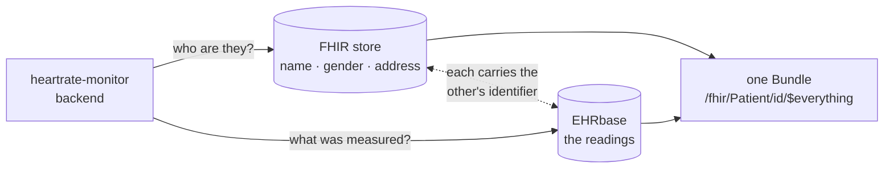

# heartrate-monitor

A small application that shows the resting heart rate of the last 30 days.

It is a tech-stack demo for **openEHR** (persistence, via EHRbase), **HL7 FHIR** (exchange), and
**openFHIR** (the mapping engine between the two, driven by FHIR Connect mappings).


## How the standards fit together

No *clinical* data is stored in FHIR and nothing is exchanged in openEHR — each standard does the one
job it is good at, and openFHIR is the only thing that knows how to get from one to the other. Where
the administrative half of a record lives is a separate question, and the next section is about it.

```
      FHIR Observation (R4, LOINC 40443-4)
                  │
                  │ openFHIR · /openfhir/toopenehr   (FHIR Connect mappings)
                  ▼
          openEHR COMPOSITION
                  │
                  │ backend · POST /ehr/{id}/composition
                  ▼
               EHRbase ──── AQL ────────────────────────────► Svelte chart
            (openEHR CDR)
                  │
                  │ AQL, then openFHIR · /openfhir/tofhir
                  ▼
             FHIR Bundle   (GET /fhir/Observation)
```

- **Importing.** A resting heart rate becomes an `Observation` (LOINC `40443-4`, category
  `vital-signs`, UCUM `/min`). openFHIR maps it onto `openEHR-EHR-OBSERVATION.pulse.v2` inside an
  `openEHR-EHR-COMPOSITION.encounter.v1`, and EHRbase validates and stores it.
- **Reading.** AQL pulls the values back out of the CDR for the chart.
- **Exporting.** `GET /fhir/Observation` sends the stored compositions back through openFHIR, so
  outgoing FHIR is produced by the same mapping definition as incoming FHIR.

Data only ever enters through the FHIR endpoints — no back door into the database, and no seeding.
Even the by-hand entry form builds a FHIR Observation in the browser and posts it to
`/fhir/Observation` like any other client would.

## Two stores, and which answers what

The diagram above is the translation axis. There is a second one: where a record actually lives.

openEHR anchors a record on an identifier and nothing more — `EHR_STATUS.subject` has no room for a
name, a gender or an address. So a patient could be pointed at but never described, and
`Observation.subject` referred to a Patient that existed nowhere. The **FHIR store** is where those
belong: the backend's own Postgres, one table of Patients kept as the FHIR JSON they are.

That makes two stores but one service. The backend translates *and* stores the patients — the same
shape as the vaccination POC's reference server, where one FHIR API service splits a payload into
the part for its own FHIR database and the part for openEHR. What stays separate is the data: two
databases, each with its own schema and lifecycle.

| Question | Answered by |
|---|---|
| Which patients exist? | configuration (`heartrate.patients`) — the demo's roster |
| Who are they? | the FHIR store — name, gender, birth date, address |
| What was measured? | openEHR, as compositions in EHRbase |

The two are joined by one ordinary identifier: the Patient carries its EHR id as a secondary
identifier, and openEHR carries the patient id in `EHR_STATUS.subject`. Either side can be reached
from the other, and neither store knows the other exists.



That dotted line is the whole join. It is not a foreign key and neither store resolves it — each
side simply carries the other's identifier, and the backend is the only thing that ever follows it.
When a patient is updated through `PUT /fhir/Patient/{id}`, the backend re-attaches that identifier
whatever the body says: a client editing an address must not be able to cut the patient off from
their readings.

`GET /fhir/Patient/{id}/$everything` is the only place both halves meet — one Bundle, assembled from
two stores, with nothing in it saying which entry came from where. The pipeline inspector's stage
**Both halves, one Bundle** takes that assembly apart again, store by store, beside its JSON.

Keeping the roster in configuration rather than in the FHIR store is what lets the halves fail
independently, even inside one service: `docker compose stop fhirdb` and the chart still draws, the
AQL playground still answers, and the patients fall back to how the configuration seeds them. The
backend only reaches for that database when a patient is asked for, so it even starts without it.

**No index table stands between the two.** A FHIR `Observation.id` here *is* the openEHR versioned
object uid, assigned by this service on create rather than taken from the client — so reading one
back is a composition read, not a translation, and `meta.versionId` carries openEHR's version
straight through. Correct a reading and the id stays while the version moves.

## Importing data

`POST /fhir/Bundle` (and the **Import a file** button) takes a FHIR Bundle carrying resting heart
rate Observations. Codings are normalised on the way in, so an Observation using `{beats}/min` or
`bpm` rather than `/min` still imports, and one coded with SNOMED `444981005` instead of LOINC
`40443-4` does too — rejecting equally-correct FHIR would be a bug, not strictness.

The answer is a FHIR `OperationOutcome` saying what went in and what did not:

```json
{"resourceType":"OperationOutcome","issue":[
  {"severity":"information","diagnostics":"Imported 22 heart rate observations."},
  {"severity":"warning","diagnostics":"Skipped 1 Observation (not a resting heart rate (no LOINC 40443-4 coding))"}]}
```

## The guided tour

Every other part of this application explains *how* the three standards work. None of them answers
why one heart rate needs three standards at all — and that is the question someone meeting openEHR
for the first time actually has. The tour is that answer, told as one argument in eleven short
steps, using the tabs as its stage:

1. **What this is.** One resting heart rate per day — 58, in the entry field on screen. Storing it
   is trivial; storing it so it still means something in twenty years is the real problem.
2. **Why a database column is not enough.** `bpm INT` holds 58. It does not hold the unit, whether
   the patient was at rest, who measured it, or with what.
3. **What FHIR contributes** — the number says what it is, in codes, so it can cross a boundary.
4. **What openEHR does differently** — the LOINC code is gone; the meaning is now the *place*, an
   internationally agreed archetype. And openEHR demands what FHIR never sent.
5. **Two models, not one in two formats** — what the round trip does not bring back, and why that is
   not a bug.
6. **Where the rest of it lives** — the name and address openEHR has no room for, in a second store,
   joined to the record by one identifier; shown where the two meet in one Bundle.
7. **So something has to translate** — openFHIR, and the rules it follows.
8. **What the model allows, and what is used** — ten of the template's twenty-three nodes.
9. **The record does not forget** — correcting adds a version, never overwrites; told in the traffic
   console, where the correction is a PUT with If-Match.
10. **And it stays queryable** — AQL by archetype path.
11. **That is the whole idea** — and a pointer to **Build your own**.

Each step switches to the tab it belongs on, selects the right pipeline stage where that matters, and
rings the thing it is talking about — so "notice the LOINC code is gone" arrives with the JSON on
screen rather than as a claim. It can be stopped at any point, and the compass button beside the title
starts it again from any tab.

The **Start here** panel can be hidden once it has served its purpose; a link in its place brings it
back, and the tour is reachable from the header regardless.

## Finding your way in

The overview opens with a **Start here** panel: three steps in the order that makes sense — get a
month of readings in, watch one of them cross into openEHR, watch the servers talk. It notices when
step one is already done, and it can be dismissed for good.

Every term the app puts on screen explains itself where it appears. `at0004`, `DV_QUANTITY`,
`archetype_node_id`, `PARTY_SELF`, `AQL`, LOINC `40443-4` — anything underlined is hoverable,
**including inside the JSON panels**, which is where the vocabulary is at its most opaque and where
a glossary page would be least use. Around thirty terms are covered; each says what the thing is and
what it is not to be mistaken for, which is usually the part that matters:

> **POINT_EVENT** — A value measured at one moment. The alternative is an INTERVAL_EVENT, which
> carries a math_function and means "the minimum over the day". FHIR leaves that distinction to the
> code; openEHR puts it in the structure.

The terms live in `frontend/src/lib/glossary.ts`; adding one makes it hoverable everywhere at once.

## English and German

The switch beside the title changes both halves of the application. Most of the teaching text is
generated by the backend — the pipeline stages, what each mapping did, why a reading was refused —
so every request carries `Accept-Language`, and Spring resolves it per request. Translating the
buttons while leaving the explanations in English would translate the packaging and not the content.

- Backend text: `backend/src/main/resources/messages.properties` and `messages_de.properties`.
  A test asserts the two files carry exactly the same keys and that nothing German is still the
  English string — a key present in one and missing in the other shows up as a raw `explain.composition`
  where a paragraph should be, and nothing else catches that.
- Frontend text: `frontend/src/lib/i18n.svelte.ts`, with the glossary's German bodies in
  `glossary.ts`.

Terminology stays untranslated on purpose. `COMPOSITION`, `Archetyp`, `Template`, `Observation`,
`DV_QUANTITY`, `at0004` — those are the words in the specifications and the strings visible in the
JSON panels. Germanising them would break exactly the recognition the glossary exists to support.

The language is remembered, and follows the browser on a first visit.

## The pipeline inspector

The chart is the excuse; the standards are the point, and an import that works hides everything
worth seeing. The **Pipeline inspector** tab runs one reading through the same path an import takes
and keeps every intermediate form. It never writes: a trace maps and reads, so the same reading can
be followed twenty times and the record is exactly as it was. The way back reads the record as it
is, so on a fresh install it has nothing to show until a reading has been stored.

A POST and a GET are two operations, not one long line, and the inspector shows them apart. Every
stage is a document; every arrow carries whoever turns one into the next:

```
the way in · POST

  FHIR Bundle · Client
      │ Backend
  FHIR Observation ───── Who it is about · FHIR store
      │ Backend
  FHIR Bundle
      │ openFHIR
  openEHR COMPOSITION
      │ Backend
  Create or correct

the way back · GET

  openEHR COMPOSITION · EHRbase
      │ openFHIR
  FHIR Bundle
      │ Backend
  FHIR Bundle, as served
      │ Backend
  Both halves, one Bundle ───── Who it is about · FHIR store
```

Reading it that way settles two things that a row of boxes kept muddling. openFHIR is not a place
the reading ever *is* — it is what happens between two documents, and it happens on both journeys,
which is why the same COMPOSITION and the same Bundle appear in both diagrams with the arrow
reversed. And the openEHR COMPOSITION is EHRbase's document: on the way in openFHIR has just made
it and EHRbase is what it is handed to; on the way back it is what EHRbase answered with.

The way in ends at the write it would make — shown, not sent. Two questions are answered on that
stage, both by asking openEHR and both reads. Which record: a FHIR Observation names a subject and
openEHR addresses an EHR by id, and `EHR_STATUS.subject` is the bridge, so the EHR is found by AQL
rather than kept in configuration — and remembered, so that query only runs on the first trace
after a start. Which write: the import looks for a composition on the same day first, and if there
is one the reading is a correction, a `PUT` with `If-Match` that adds a version rather than a
`POST` that adds a second fact. That query really runs in the inspector every time; only the write
does not. Neither answer is a document the composition became, which is why they are told on the
write's stage rather than given stages of their own — one ends up in the request path, the other in
its method. The way back
starts at that record, because that is where a GET starts: EHRbase is asked what it holds, and only
what comes out of it goes through the mappings. It also does not care what was dropped in — the
newest composition the export's query answers with is the one followed back, whichever sample the
way in was shown with, which is why the direction switch sits above the inputs and the inputs
belong to the way in alone. openFHIR's answer is not yet what a client
receives, either — the backend puts the composition's uid in as the id, its version as
`meta.versionId`, and the patient as the subject — so that is a stage of its own, and the round-trip
differences are measured against it rather than against the raw answer. What hangs off the line in
both directions is the FHIR store — a reading never passes through it, so drawing it as a stage
would say the Bundle was made out of a Patient. Its one contribution is the identifier that joins the
two halves. Its read is labelled with the SQL it runs rather than a URL: it is the backend's own
database, not another server.

The inspector runs the import's own parts rather than a copy of them: the same-day query, the
export's AQL and the export's post-processing are `HeartRateService`'s, called from the trace. That
is also why `POST /fhir/Observation` now recognises and rebuilds a single Observation the way a
Bundle entry is — before, an Observation coded in SNOMED or in `bpm` went through the inspector
and failed at the endpoint, and the inspector was describing a road the endpoint did not take.

Each stage is shown beside the one it came from, so every screen reads "this became that"; a branch
has no "came from" at all and is shown on its own. Wherever a FHIR document and an openEHR document
sit side by side — either side of an openFHIR arrow, so on both journeys — a row of correspondences
lights up the matching lines in both at once and highlights the FHIR Connect rule that produced
them, including the two that are not value copies:

- **The code selects the archetype.** LOINC 40443-4 never becomes data in openEHR. It is a
  condition; it decides which archetype the value lands in, and the archetype is then where the
  meaning lives. FHIR says what it means in its codes, openEHR in its structure.
- **What openEHR demands and FHIR never sent.** `composer`, `language`, `territory`, `category` and
  `context` are mandatory in the openEHR reference model and are nowhere in the Bundle.

The way back's Bundle is mapped through the same files in the other direction, and the stage after
it lists what did not survive. openEHR stored no code at all — the archetype is the meaning — so
the LOINC code and its system are written back by the mapping as constants; a Coding without a
system would not be a LOINC code, just a string that looks like one. The display names are not
written back, and they are the loss that shows. The round trip is not lossless, and seeing exactly
where it loses, and where the mapping chose to cover the gap, is the shortest explanation of how
the two models differ.

Three ready-made inputs cover the interesting cases: a textbook Bundle, the same reading spelled
with SNOMED and `bpm` instead of LOINC and `/min`, and an Observation coded 8867-4 — a heart rate,
but not a resting one — which stops the pipeline at the door. Any file of your own works too.

Picking a correspondence also offers **Open the rule in …**, which jumps to the Mappings tab with
that rule highlighted.

## The mappings, and editing them

The **Mappings** tab opens with **What becomes what** — every rule the files declare, read out of
them rather than written alongside:

```
rate               $resource.value       →  $archetype/…/items[at0004]     pulse.model.yaml:32
time               $resource.effective   →  $archetype/…/events[at0003]/time
hardcodedMappings  $resource             →  $archetype
  code             writes  code.coding.code    = 40443-4
  code             writes  code.coding.system  = http://loinc.org
  status           writes  status              = final
```

Two kinds, and the difference is the interesting part. A **correspondence** connects a FHIR path to
an openEHR path. A **constant** writes a fixed value into outgoing FHIR — which is how an exported
Observation carries a LOINC code that openEHR never stored, because in openEHR that meaning lives in
the archetype instead. Indentation is the nesting: a nested rule only applies inside its parent.
Picking one finds it in the file below.

Because the list is parsed from the YAML, editing a mapping changes it. A list that could disagree
with the file would be worse than none.

The files themselves are editable. **Edit this mapping** writes the real file in
`openfhir-bootstrap/` and the backend hands openFHIR the new version over its REST API — a
`PUT /fc/model/{id}`, visible in the traffic console. No rebuild, no restart, because the mappings
are data.

Picking a correspondence in the pipeline inspector offers **Open the rule in …**, which brings you
here with the right file open and the rule highlighted. Coming back re-runs the trace, so a mapping
you just changed is reflected immediately.

Which makes the most instructive thing you can do breaking one on purpose. Change the LOINC code in
`pulse.model.yaml` from `40443-4` to anything else, save, and go back to the inspector:

```
1 FHIR Bundle →Backend→ 2 FHIR Observation →Backend→ 3 FHIR Bundle →openFHIR→ 4 openEHR COMPOSITION ✗
                              └── Who it is about

openFHIR answered with an empty composition — nothing in the Bundle matched the
conditions in pulse.model.yaml.
```

The Observation is still valid FHIR. openFHIR still runs. It simply no longer recognises the
resource as a pulse, so nothing lands in the archetype — which is the clearest possible statement of
what that code was doing there. An edited file is marked with a dot, and **Reset to the shipped
version** puts it back.

A mapping openFHIR refuses is still written to disk; the answer says what it objected to and the
engine keeps mapping with the version it had. A file that is not even a FHIR Connect context or
model is not sent at all. Hiding either would remove the lesson.

## The standards traffic console

The **Standards traffic** tab is a network console for the two servers behind the backend: every
call it made to openFHIR and EHRbase, newest first, each one expandable to its request and response
body. It is where the openEHR REST API stops being a spec and becomes something you watch — a
COMPOSITION going to `POST /ehr/{id}/composition` and coming back 204 with the version uid in an
`ETag`, an AQL query being answered, the template upload answering 409 on every restart after the
first because the template is already known, and on every start the template and the mappings being
handed to openFHIR: a `GET /fc/model` to find what it holds, a `PUT /fc/model/{id}` to replace it.

The patients are not in it. They are the backend's own database, and reading that is a query, not a
call to anyone.

The buffer holds the last 300 calls in memory and is not an audit log. Headers are deliberately not
recorded: EHRbase runs with basic auth and its credentials have no business in a browser panel.

## The AQL playground

The **AQL playground** tab runs a query you typed against the real record. AQL is openEHR's own
query language and the reason an openEHR record is queryable without knowing how it is stored: it
selects by archetype path, so a query written against the pulse archetype runs on any openEHR system
that knows that archetype.

Six ready-made queries, each there to show one thing — the query the chart actually runs, taken
from the code the chart calls rather than copied, a whole composition, which archetypes are in the record, aggregates, the versioning underneath
(`CONTAINS VERSION`), and this one:

```
SELECT o/data[at0002]/events[at0003]/data[at0001]/items[at9999]/value/magnitude AS bpm
FROM EHR e[ehr_id/value=$ehrId]
  CONTAINS OBSERVATION o[openEHR-EHR-OBSERVATION.pulse.v2]
```

`at9999` is not in the pulse archetype. It does not fail — ten rows come back, one per observation,
every value null. **A wrong path is not an error in AQL**, it simply matches nothing, and that is the
failure mode worth meeting deliberately rather than in production.

Each result shows its column metadata: the AQL path behind every column name, which is where the
names come from and what an aggregate column lacks. `$ehrId` is filled in automatically — making
someone paste a uuid before their first query teaches nothing about AQL.

Read-only, and not by enforcement: AQL has no write operations at all. The guard that rejects
anything not starting with `SELECT` exists to give a useful answer when someone pastes SQL out of
habit, not to make this safe.

## The template explorer

The operational template is the third thing the mappings depend on, and the only one the application
never showed. EHRbase validates a composition against it; openFHIR resolves paths against it. The
**Template explorer** tab reads the `.opt` and shows it as what it is — every node a composition may
have, its reference model type, the archetype's own name for it, how often it may occur, and the
path AQL would address it by.

Each node is marked with whether the stored data actually reaches it, which answers a question
neither side can answer alone:

```
10 / 23 nodes of the template are used
```

A template describes what *may* be recorded, not what is, so a gap is normal. But one part of the
gap is the point. Under the pulse observation sits a second event slot:

```
○ events  INTERVAL_EVENT  Maximum  at1036  0..1
    ○ math_function  DV_CODED_TEXT  1..1
```

The model has room for the minimum, maximum and mean of a period, named and typed, ready to use.
The mapping never fills it — FHIR Connect as implemented by openFHIR 3.0.1 cannot write a
`math_function`. **The template says what is possible; the mappings decide what happens**, and here
you can see the difference rather than read about it.

## Recording a reading by hand

The **Record a reading** panel on the overview takes a date and a number — and then does not take a
shortcut. The browser builds a FHIR Observation from what you typed and posts it to
`/fhir/Observation`, so a reading entered by hand travels the same road as one from an external
system. "Show the resource this sends" reveals what a number has to be dressed in before it counts
as a clinical fact: a status, a category, a LOINC code, a UCUM unit, a subject.

That keeps the rule the rest of this README describes intact — data still only enters through the
FHIR endpoints, there is still no back door into the database.

### Correcting a day

Recording a day that already has a reading corrects it, and openEHR's answer to "overwrite" is worth
watching in the traffic console: there isn't one. The service finds the composition already covering
that day and sends `PUT /ehr/{id}/composition/{uid}` with an `If-Match` naming the version being
replaced. EHRbase answers with `::2`, then `::3` — a new version each time, the previous ones still
in the record. `If-Match` is also what stops two people correcting the same day from silently
clobbering each other.

The chart therefore asks for the value **committed last**, not the first one the store happens to
return. Days written before this existed may still carry more than one composition; they are left
alone and the most recently committed one wins.

**Show what this day used to say** in the same panel reads the history back — every version, what it
held, and openEHR's own word for what happened to it:

```
v1  56 bpm  CREATION      14 Sept, 10:15
v2  54 bpm  MODIFICATION  14 Sept, 10:54
v3  49 bpm  MODIFICATION  14 Sept, 10:54   in force
```

That comes from `GET /ehr/{id}/versioned_composition/{uid}/revision_history` plus one read per
version. Worth knowing if you build on this: the version uid belongs in the **path**
(`…/version/{uid}`). Passing it as `?version_uid=` is accepted by EHRbase and quietly answers with
the latest version every time, which looks exactly like a record whose history never changed.

## Building your own

Every other tab explains how this application works. The **Build your own** tab is for someone who
wants the same structure around a measurement of their own — body weight, blood pressure — and has
three parts:

- **What it is made of.** Every piece with its exact version, its port, what it is for, and whether it
  is part of the structure (EHRbase, openFHIR, the FHIR store) or this particular application (the
  backend), which is yours to replace. The frontend is left out on purpose: it is this teaching page,
  and someone building the same structure needs none.
- **Your own measurement, step by step.** Seven steps in the order they depend on each other — find
  the archetype, build the template, decide the FHIR side, write the mappings, teach the backend, load
  and try it, query it — each naming the files it changes and linking to the tab where the heart
  rate's version of that step can be looked at.
- **Where it goes wrong.** The mistakes whose symptom points somewhere other than the cause: a changed
  template EHRbase silently keeps the old version of, a mapping openFHIR still has the old version
  of, an AQL path that is wrong and still not an error.

A version list that disagrees with what actually runs is worse than none, because someone copies it.
So the list in `frontend/src/lib/stack.ts` is not trusted: `StackListTest` in the backend holds it
against every image `docker-compose.yml` pulls and the versions the Gradle build pins. Bump one
without the other and `./gradlew test` says so.

## What is in the repository

| Path | What it is |
|---|---|
| `docker-compose.yml` | EHRbase + Postgres, openFHIR + MongoDB, the FHIR store's Postgres, the backend and the frontend dev server |
| `openfhir-bootstrap/` | The openEHR operational template and the FHIR Connect mappings — the one copy, which the backend hands to EHRbase and openFHIR |
| `backend/` | Spring Boot service (Gradle, Java 21, HAPI FHIR 8.8.1) — the one service: it talks to both servers and keeps the patients in its own Postgres over plain JDBC; its Dockerfile builds from the repository root, because it needs `openfhir-bootstrap/` too |
| `frontend/` | Svelte 5 + TypeScript + Vite single page app |

### The mappings

`openfhir-bootstrap/` is the interesting part — it is where the two models are reconciled, in
declarative YAML rather than in Java:

- `heartrate_monitor.opt` — the openEHR operational template, uploaded from this one file to **both**
  EHRbase (so it can validate compositions) and openFHIR (so it can resolve paths).
- `heartrate.context.yaml` — the context mapper: FHIR Bundle ⇄ the `heartrate_monitor.v1` template.
- `heartrate-encounter.model.yaml` — maps bundle entries into the composition's pulse slot.
- `pulse.model.yaml` — maps `Observation.value` ⇄ the archetype's Rate element, and declares the
  codes that identify an Observation as a resting heart rate in the first place.

openFHIR does not read this directory. The backend hands it every file over openFHIR's REST API when
it starts — `/opt`, `/fc/context`, `/fc/model`, each matched with what openFHIR already holds and
replaced rather than added twice — and hands over one file again whenever the mapping editor saves
it. Changing a mapping needs no rebuild: save it in the editor, or edit the file and
`docker compose restart backend`.

## Running it

**One copy per person.** This is meant to run on your own machine, not as one shared server for a
class. Everything in it is shared by whoever reaches it — the patients, their readings, and above
all the mapping files, which the **Mappings** tab writes for real: breaking a mapping on purpose is
the most instructive thing to do with it, and on a shared instance it breaks the pipeline for
everyone. Nothing here has access control either. openFHIR has no authentication, EHRbase's
credentials are in `docker-compose.yml`, and Docker publishes the ports on every network interface,
so on a shared network the others can reach yours too.

### What you need

- **Docker.** Docker Desktop on macOS and Windows; on Linux, Docker Engine with the Compose plugin
  (`docker compose`, not the older `docker-compose`).
- **At least 4 GB of memory for Docker.** The seven containers use roughly 2 GB at rest, measured
  with `docker stats`; the rest is headroom for the first build. In Docker Desktop that is
  *Settings → Resources*.
- **About 3.5 GB of disk** for the images, plus the Gradle and npm caches of the first build.
- **Ports 5173, 18080–18082 and 18084 free.**
- **Java 21 and Node 22 only if you want them.** Everything runs in containers; the two are needed
  just for running the backend or the frontend outside Docker while working on them, below.

| Port | What answers |
|---|---|
| **5173** | the frontend — the one to open |
| 18080 | the backend |
| 18081 | EHRbase |
| 18082 | openFHIR |
| 18084 | the FHIR store's Postgres |

```sh
git clone https://github.com/brodbeckleon/heartrate-monitor.git
cd heartrate-monitor

# Seven containers. The first start pulls images and builds the backend and the frontend, which
# takes a few minutes; after that it is seconds.
docker compose up -d
```

That is the whole thing. On startup the backend uploads the operational template, creates an EHR for
each patient and writes the patients into the FHIR store, so <http://localhost:5173> is ready as soon
as the containers are healthy. `docker compose down` stops it and keeps the data; `docker compose
down -v` throws the data away as well.

### Working on the backend

A containerised backend has to be rebuilt to pick up a code change, which is no way to write code.
So take it out of the way and run it on the host instead:

```sh
docker compose stop backend
cd backend && ./gradlew bootRun
```

Nothing else needs changing: port 18080 is published either way, and the frontend container reaches
it through `host.docker.internal:18080` in both cases. When you are done, `docker compose up -d
--build backend` puts the container back with your changes in it.

The same applies to the frontend: `docker compose stop frontend` and `cd frontend && npm install &&
npm run dev`.

**Two things to know when the backend runs on the host.** `docker compose` no longer restarts it, so
after a code change it has to be restarted by hand — and `./gradlew bootRun` will refuse to start
while the previous one still holds the port:

```
Web server failed to start. Port 18080 was already in use.
```

That message scrolls past easily, and the old build keeps serving as if nothing happened. A backend
older than the page produces symptoms that point nowhere near the cause: corrections that never
appear in the chart, an empty pipeline inspector, an empty traffic console. The page checks
`/api/about` on load and says so plainly when it happens.

Open <http://localhost:5173> and press **Load sample data**, or from the command line:

```sh
curl -s 'http://localhost:18080/fhir/Bundle/$sample' \
  | curl -X POST http://localhost:18080/fhir/Bundle \
      -H 'Content-Type: application/fhir+json' --data-binary @-
```

There is no sample file in the repository on purpose. The chart shows the last 30 days, so fixed
dates walk out of the window and a checked-in file would need regenerating to stay useful.
`GET /fhir/Bundle/$sample` makes one up ending today instead — deterministic per day, with a few
days missing so the coverage figure has something to say.

### Checking the pieces

```sh
curl http://localhost:18082/fc/model                         # the mappings openFHIR holds
curl 'http://localhost:18080/fhir/Observation?days=30'       # the FHIR view
docker exec hrm-fhirdb psql -U fhirstore \
  -c 'select resource_id, updated_at from stored_resource'   # the FHIR store, table and all
curl -u ehrbase-user:SuperSecretPassword \
  http://localhost:18081/ehrbase/rest/openehr/v1/definition/template/adl1.4
```

## API

| Method | Path | Purpose |
|---|---|---|
| `POST` | `/fhir/Bundle` | Import a FHIR Bundle; answers with an `OperationOutcome` |
| `GET` | `/fhir/Bundle/$sample?days=30` | A generated month of readings, ending today — nothing stored |
| `POST` | `/fhir/Observation` | Ingest a single resting heart rate Observation; one that is not a resting heart rate is refused with 422 and an `OperationOutcome` saying why |
| `GET` | `/fhir/Observation?days=30` | Everything stored, as a FHIR searchset Bundle |
| `GET` | `/api/heart-rate?days=30` | The daily resting heart rates the chart draws |
| `GET` | `/api/history?date=2026-09-11` | Every version of what is recorded for one day |
| `GET` | `/api/trace/samples` | The ready-made inputs the inspector offers |
| `POST` | `/api/trace` | The pipeline inspector: the import with nothing thrown away, and nothing written |
| `GET` | `/api/mappings` | The FHIR Connect files as they are on disk |
| `GET` | `/api/mappings/rules` | Every rule the mappings declare, parsed from the files |
| `POST` | `/api/mappings/{file}` | Write one mapping and hand openFHIR the new version |
| `POST` | `/api/mappings/{file}/reset` | Restore the shipped version of one mapping |
| `POST` | `/api/aql` | Run one AQL query, read-only; body is the query as text |
| `GET` | `/api/aql/examples` | The ready-made queries the playground offers |
| `GET` | `/api/template` | The operational template as a tree, marked with what the data uses |
| `POST` | `/api/traffic/clear` | Empties that buffer |
| `GET` | `/api/traffic?since=0` | Calls made to openFHIR and EHRbase, for the traffic console |
| `GET` | `/api/about` | What this build can do; a 404 tells the page the backend is older than it is |
| `GET` | `/fhir/Patient` | The patients this instance knows, from the FHIR store; `?identifier=system\|value` finds the one carrying an EHR id |
| `GET` | `/fhir/Patient/{id}` | One of them; this is what `Observation.subject` resolves to |
| `PUT` | `/fhir/Patient/{id}` | Replace one patient's details in the FHIR store; the link to their openEHR record is kept whatever the body says |
| `GET` | `/fhir/Patient/{id}/$everything` | The whole record as one Bundle — the patient from the FHIR store, the readings from openEHR |
| `GET` | `/fhir/Observation/{id}` | One reading, addressed by the openEHR composition uid that is its FHIR id |

## Notes

- Each patient in `heartrate.patients` has an EHR of its own. The id is not configured: it is
  looked up from `EHR_STATUS.subject` and created on first use, so the record survives restarts
  without this service remembering a uuid. `heartrate.default-patient` is who a request is about
  when it names none.
- Every clinical endpoint takes `?patient=`, defaulting to `heartrate.default-patient`. An id outside
  the roster is a 404 rather than a new record.
- The FHIR store's Postgres is published on `:18084`, so `./gradlew bootRun` in `backend/` uses the
  same database the container does.
- The frontend container keeps `node_modules` in a named volume, which a host `npm install` does not
  write to — the volume is mounted over the directory it would land in. Its entrypoint compares
  `package-lock.json` against a stamp in the volume and installs when they differ, so adding a
  dependency on the host reaches the container on its next start. A start with nothing to do costs
  one checksum.
- The operational template was derived from Better's *NEWS2 Encounter Parent* template, reduced to
  the single pulse observation.
- The open-source edition of openFHIR has no authentication; EHRbase runs with basic auth. Neither
  configuration is meant for anything but local use.
- EHRbase compares `DV_DATE_TIME` bounds in AQL as text, and Java's `OffsetDateTime.toString()` omits
  the seconds when they are zero. `2026-09-08T00:00Z` is valid ISO-8601 and silently matches nothing;
  `Instant.toString()` always writes them out, which is why the query parameters go through it.

## Checks

```sh
cd backend  && ./gradlew test     # 67 tests
cd frontend && npm run check      # svelte-check (TypeScript)
cd frontend && npm run lint       # eslint + prettier --check
cd frontend && npm run format     # prettier --write
```

## Licence

MIT — see [`LICENSE`](LICENSE). Take it apart, build on it, hand it on.

That covers the code and text in this repository. The archetypes the operational template is built
from come from the openEHR Clinical Knowledge Manager, and the images `docker-compose.yml` pulls come
from their own projects; each of those carries a licence of its own. The favicon,
`frontend/public/favicon.svg`, is the ZHAW logo mark — a trademark of the Zurich University of
Applied Sciences, not covered by the MIT licence.
